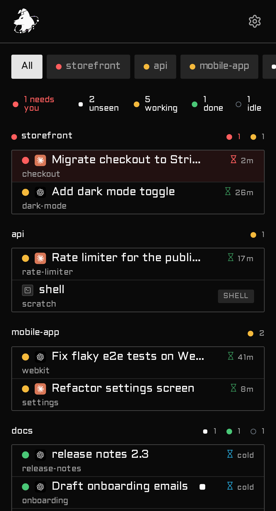
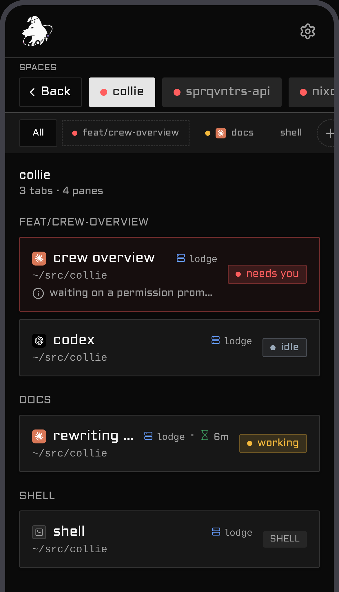
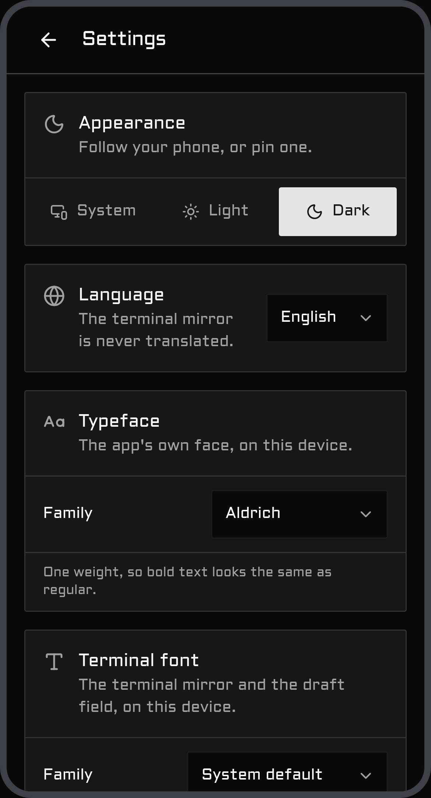

# Collie

<p align="center">
  
</p>

A phone web UI for your [Herdr](https://herdr.dev) agent herd, served over Tailscale. Open a URL,
see which agent needs you, and reply with your phone's keyboard. The reply box is a plain text field,
so your phone's own voice dictation (Android & iOS) works in it for free — Collie doesn't ship any
voice support of its own. Each agent gets a colored terminal mirror, a slash-command palette, and a
special-keys pad.

A Herdr plugin (thin launcher) plus a Bun/TypeScript bridge running as a `systemd --user` service,
serving a Vite + React + shadcn PWA.

## Contents

- [Demo](#demo)
- [Security — read first](#-security--read-before-you-run-it)
- [Requirements](#requirements)
- [Install](#install)
- [First run — what you'll see](#first-run--what-youll-see)
- [Configure](#configure)
- [Commands](#commands) · [Herdr actions](#herdr-actions)
- [Update](#update-to-a-new-release)
- [Uninstall](#stop-or-uninstall)
- [Deployment variants](#deployment-variants)
- [Web Push](#web-push-optional)
- [Troubleshooting](#troubleshooting)
- [Architecture](#architecture)
- [Developing this plugin](#developing-this-plugin)

## Demo

https://github.com/user-attachments/assets/6334eab2-d503-4cfe-b770-80c4517e9482

A run through the herd from a phone: the dashboard floats the agent that **needs you** to the top,
you drill into a space's tabs and panes (long-press a pane pill or a tab chip to rename or close it —
and a Claude pane shows the name you gave it with `/rename`), switch between herds, and pick up a push
notification the moment an agent is waiting on input.

<table>
  <tr>
    <td align="center" width="50%"><br><sub><b>Dashboard</b> — agents needing you float to the top</sub></td>
    <td align="center" width="50%"><br><sub><b>Space</b> — its tabs and panes, deep-linkable</sub></td>
  </tr>
  <tr>
    <td align="center" width="50%"><br><sub><b>Session switcher</b> — one bridge, every herd</sub></td>
    <td align="center" width="50%"><br><sub><b>Settings</b> — notifications, DND, diagnostics</sub></td>
  </tr>
</table>

## Motivation

I wanted to check on my agents from my phone. The usual route is [Termux](https://termux.dev) — SSH
in, attach to the terminal — but driving a TUI through its on-screen controls is miserable: the
special keys are fiddly, `Ctrl`/`Esc`/arrows are buried behind chords, and every reply is a fight
with the keyboard. I wanted something that feels like an app, not a terminal squeezed onto a
touchscreen: tap the agent that needs you, type with your real keyboard, fire `Esc` or `Ctrl+C` with
one thumb. Collie is that.

## Who is this for

You, if you run [Herdr](https://herdr.dev) agents on a machine and want to resume a session from
your phone — read what an agent is asking, type a reply, fire a special key — without SSHing in and
wrestling a TUI. It assumes a **[Tailscale](https://tailscale.com) tailnet (mesh) setup**: your
phone and the host are on the same tailnet, and `tailscale serve` is the only way in. It's
deliberately **single-user**: one operator, one tailnet, no multi-tenant auth. If that's your setup,
Collie fits. If you need shared or public access, it isn't built for that — and see the security
note below before you run it.

## ⚠️ Security — read before you run it

**Collie is remote shell access to your machine, by design.** One bridge call types arbitrary
keystrokes into a live terminal pane, so anyone who can reach the URL can read every pane (source,
secrets, env, agent output) and run any command as your user. No sandbox, no command allow-list
(that would defeat the purpose). Treat the URL like a root login.

Three sharp edges:

- **It acts as _you_**, with your full privileges — `~/.ssh`, `git push --force`, `rm -rf`, `sudo`.
- **Access is device-level, not person-level.** Tailscale proves the device, not who's holding it.
  No password, no session — an unlocked or stolen phone (or anyone else on your tailnet) is an open
  shell. The idle-lock is UX, not auth. Every write action (replies, keys, uploads, pane/tab
  create/close) is appended to `<state-dir>/audit.log`, so there is at least a trail — but a trail
  is not a gate.
- **One bridge fronts _every_ session.** With `COLLIE_MULTI_SESSION` on (the default), the bridge
  discovers and serves every named Herdr session under your config root — a private or sandbox
  session (e.g. `collie-demo`) is readable and drivable through the same URL as your primary, and the
  set is rescanned periodically. Set `COLLIE_MULTI_SESSION=0` to serve only the primary session.

It's built single-user and tailnet-only. The defenses:

- **Loopback bind only** (`127.0.0.1`) — never `0.0.0.0`.
- **Exactly one hardened front door** — either `tailscale serve` (default, Variant A: terminates
  TLS, injects the identity header) or a conforming reverse proxy
  ([Variant C](#variant-c--reverse-proxy-as-the-only-front-door-no-tailscale)). Never
  `tailscale funnel`, never a bare port.
- **Optional identity gate** — set `COLLIE_TRUSTED_USER` to reject anyone but you.
- **Optional per-device gate** — behind a proxy that injects a device-identity header, set
  `COLLIE_DEVICE_HEADER` + `COLLIE_DEVICE_ALLOWLIST` so only allowlisted devices can drive agents;
  any other device is read-only. Off by default; revoke a device by dropping it from the list.
  See [Deployment variants](#deployment-variants) for the proxy this requires.
- **Same-origin gate + strict CSP**; pane output renders as React text nodes, never `innerHTML`.
- **Required remote Host allowlist** — set `COLLIE_PUBLIC_HOSTS` to every exact host or `host:port`
  you serve on (for example, your IP, FQDN, and MagicDNS name). Remote requests are denied when the
  list is empty. Values are canonicalized before exact comparison, allowed origins do not expand the
  list, and a loopback Host is accepted only from an actual loopback socket peer on a direct,
  non-forwarded request.

> 🚫 **Never `tailscale funnel` this** — funnel exposes it to the public internet; `serve` keeps it
> tailnet-only. There is no scenario where funneling Collie is correct.

Narrow the blast radius with Tailscale ACLs and `COLLIE_TRUSTED_USER`. Provided as-is, no warranty.

## Requirements

On the **host** (the tailnet node your agents run on):

| Tool | Why |
| --- | --- |
| [**Bun**](https://bun.sh) | Runs the bridge and builds the web UI — the only hard dependency. |
| [**Herdr**](https://herdr.dev) ≥ 0.7.0 | The herd Collie mirrors; its CLI registers the plugin. |
| [**Tailscale**](https://tailscale.com) | Front door for the default variant (`tailscale serve`); optional if you run [Variant C](#variant-c--reverse-proxy-as-the-only-front-door-no-tailscale) behind your own reverse proxy. Without any front door, the bridge is `127.0.0.1`-only. |
| **git** | Clone, and the `update` command. |

Soft dependencies: **Node.js** (the control script uses it to extract your MagicDNS name from
`tailscale status --json`; without it the banner falls back to the loopback URL) and **`systemd
--user`** (supervises the service; falls back to a `nohup` process without it). You never install JS
deps by hand — the build runs `bun install` for you; the backend imports only Bun + `node:*`.
[`web-push`](https://www.npmjs.com/package/web-push) is optional and lazy (see [Web
Push](#web-push-optional)).

## Install

On the host, not your phone. Two ways in.

**From GitHub (turnkey)** — Herdr clones and builds for you:

```bash
herdr plugin install AltanS/collie
herdr plugin action invoke start --plugin herdr.collie
```

**From a local clone (for development)** — registered by path:

```bash
git clone https://github.com/AltanS/collie.git && cd collie
herdr plugin link "$(pwd)"
herdr plugin action invoke start --plugin herdr.collie
```

They differ only in *when* the UI builds: a GitHub install builds at install time (the manifest's
`[[build]]` step); a linked clone builds on first `start`. Either way, `start` does four things:

1. **builds** `web/dist` if it's missing (typechecked, staged, swapped in atomically),
2. **starts the bridge** as the `systemd --user` service `collie` (`nohup` fallback without systemd),
3. **publishes it on the tailnet** — literally `tailscale serve --bg 8787`: HTTPS on the host's
   MagicDNS name, `:443 → 127.0.0.1:8787`, tailnet-only,
4. **prints the banner** with the URL to open — walked through line by line in
   [First run](#first-run--what-youll-see).

> No Herdr? Run `scripts/collie-ctl.sh start` directly — same effect (config then lives in
> `~/.config/collie/.env`).

## First run — what you'll see

The transcripts below are the control script's inline output. **Through `invoke start` you get
Herdr's JSON envelope instead** — the same text is the action's *captured stdout*, read with
`herdr plugin log list --plugin herdr.collie`.

```console
$ scripts/collie-ctl.sh start
building web UI (first run)…                    # linked clone only; a GitHub install already built
…bun install · typecheck · vite build output…
bridge started (systemd --user: collie)
tailscale serve (https) → tailnet :443 -> 127.0.0.1:8787

  ✓ Collie is running  ·  v0.9.0+debcff9
    service   systemd --user (collie) · active
    local     http://127.0.0.1:8787
    tailnet   https://myhost.tail1234.ts.net
```

The `✓` is a real probe — the script connected to the bridge's port and got an answer, not just
"the unit is active". If you get `⚠ Collie isn't answering on :8787 yet` instead, see
[Troubleshooting](#troubleshooting).

### What just happened

`start` left three durable things on the host:

1. **`web/dist`** — the built UI. The bridge serves it from disk at request time, so later UI
   rebuilds go live without a restart.
2. **A `systemd --user` service named `collie`** — unit file written to
   `~/.config/systemd/user/collie.service`, enabled and started, auto-restarting on failure.
   Inspect it with `systemctl --user status collie`. (No usable systemd? A `nohup` process with a
   pidfile in the config dir instead.)
3. **A tailnet-only `tailscale serve` mapping** — the script ran `tailscale serve --bg 8787`:
   HTTPS on the host's MagicDNS name, `:443 → 127.0.0.1:8787`. Tailscale terminates TLS (managed
   cert, nothing to obtain or renew) and injects the identity header the bridge checks. Inspect
   with `tailscale serve status`; remove just this mapping with `scripts/collie-ctl.sh unserve`.

`stop` merely pauses the service; `uninstall` reverses 2 + 3 and keeps your `.env` and the checkout.

### Open it on your phone

The URL is the banner's `tailnet` line (print it again anytime with `scripts/collie-ctl.sh url`).
It resolves for any device on your tailnet — so the phone needs the Tailscale app installed and
connected to the same tailnet as the host.

Then install it as an app: **iOS** — Safari → share sheet → *Add to Home Screen*. **Android** —
Chrome → ⋮ menu → *Add to Home screen* (or *Install app*). Installing (and Web Push) needs the
HTTPS origin the default serve mode already provides; over `COLLIE_SERVE_MODE=http` the page works,
but service worker and install silently no-op.

#### Terminal appearance

Open a pane and tap the palette button in the **View** row to configure the terminal mirror's font
family, default foreground, and background. These preferences are stored in that browser's local
storage, so each phone or desktop browser can use its own appearance. The Matrix preset selects
`MesloLGS NF` with green (`#00ff00`) on black; explicit ANSI and Oh My Posh truecolor output still
take precedence. Custom fonts must already be installed on the device running the browser, because
Collie cannot inherit a Windows Terminal profile or load fonts from the host machine.

### Is it actually working?

A sixty-second check, host side then phone side:

```console
$ scripts/collie-ctl.sh status

  ✓ Collie is running  ·  v0.9.0+debcff9
    service   systemd --user (collie) · active
    local     http://127.0.0.1:8787
    tailnet   https://myhost.tail1234.ts.net

  serve config:
    https://myhost.tail1234.ts.net (tailnet only)
    |-- / proxy http://127.0.0.1:8787
```

```console
$ scripts/collie-ctl.sh logs        # journal timestamps trimmed here
[push] disabled (no VAPID keys configured)
[bridge] listening on http://127.0.0.1:8787  (poll 1500ms)
[bridge] WARNING: COLLIE_TRUSTED_USER is empty — any tailnet device/user that reaches the bridge gets full write access. Set it to your tailnet login (see README → Variant A).
[bridge] WARNING: COLLIE_PUBLIC_HOSTS is empty — remote requests will be denied. Set it to each externally reachable host or host:port value.
```

**Both WARNINGs are expected on a fresh install.** The identity warning says who could control
Collie after ingress is configured; the Host warning means remote requests remain blocked until you
explicitly list their addresses. [Configure](#configure) both before publishing the bridge. (The
loopback URL in this example is correct: `127.0.0.1` is the default bind, and `tailscale serve`
publishes it without exposing the bridge directly.)

On the phone: your agents are listed, and the footer build stamp (`v0.9.0 · debcff9 · …`) matches
`scripts/collie-ctl.sh version`. If the page loads but stays empty, that's the same-origin gate —
see [Troubleshooting](#troubleshooting).

### Surviving reboots

A `systemd --user` service only runs while you have a login session. On a host that should serve
Collie unattended, enable lingering once:

```bash
loginctl enable-linger $USER
```

The unit is `enable`d, so with lingering it starts at boot with your user manager; the
`tailscale serve` mapping is persistent (`--bg`) and comes back on its own.

## Configure

Out of the box Collie runs **single-user and remote-deny-by-default**: loopback access works, but a
remote Host must be listed before the bridge will answer it. Once ingress is configured, anyone who
can reach an allowed Host has full control unless the identity gate is also configured. Address both
startup warnings in one sitting:

```bash
# in your .env
COLLIE_TRUSTED_USER=you@example.com                   # your tailnet login — the bridge rejects anyone else
COLLIE_PUBLIC_HOSTS=myhost.tail1234.ts.net,10.0.0.25:8787  # every exact remote host — blocks DNS rebinding
```

Config is a `.env` in the plugin's config dir — find it with
`herdr plugin config-dir herdr.collie` (typically `~/.config/herdr/plugins/config/herdr.collie`;
without Herdr, `~/.config/collie`). `collie-ctl.sh` resolves this same dir whether you run it
directly or via a Herdr action:

```bash
cp .env.example "$(herdr plugin config-dir herdr.collie)/.env"
```

The bridge reads `.env` only at startup — after any edit, `scripts/collie-ctl.sh restart`. See
[`.env.example`](./.env.example) for the full option list — commonly `COLLIE_PORT`, or
`COLLIE_SERVE_MODE=http` (Headscale / `.internal` domains; read by the control script when it runs
`tailscale serve`).

**Custom domain or reverse proxy?** See
[Variant C](#variant-c--reverse-proxy-as-the-only-front-door-no-tailscale) for the full reverse-proxy
front-door setup. The one rule to know here: Collie is same-origin only. A plain `tailscale serve` on
your MagicDNS name works as-is, but a different hostname or TLS terminator makes API calls fail with
`403 cross-origin` (page loads, stays empty). Allow the exact origin:

```bash
COLLIE_ALLOWED_ORIGINS=https://collie.example.com
```

## Commands

Every command works two ways: the **control script** on the host (`scripts/collie-ctl.sh <cmd>`) or
the equivalent **Herdr action** (`herdr plugin action invoke <cmd> --plugin herdr.collie`, written
below as `invoke <cmd>`). The ones you'll actually use:

| Action | Control script | Herdr action |
| --- | --- | --- |
| **Start** — build if needed, serve, print the URL | `collie-ctl.sh start` | `invoke start` |
| **Stop** — pause the bridge; removes nothing | `collie-ctl.sh stop` | `invoke stop` |
| **Restart** | `collie-ctl.sh restart` | `invoke restart` |
| **Status** — the *Collie is running* banner + URLs | `collie-ctl.sh status` | `invoke status` |
| **URL** — print the tailnet URL | `collie-ctl.sh url` | `invoke url` |
| **Version** — the running version (`0.x.y+sha`) | `collie-ctl.sh version` | `invoke version` |
| **Update** — `git pull` + rebuild + restart | `collie-ctl.sh update` | `invoke update` |
| **Uninstall** — remove the service; keep `.env` + checkout | `collie-ctl.sh uninstall` | `invoke uninstall` |
| **Logs** — tail the journal / log file | `collie-ctl.sh logs` | — (script only) |

`start` and `status` end with the **Collie is running** banner — annotated line by line in
[First run](#first-run--what-youll-see). Its version comes from the *served* bundle stamp, so it's
the authoritative "what's running" — note `herdr plugin list --json` shows a different value cached
at `plugin link` time; `update` re-links automatically so that self-heals (to force it:
`herdr plugin link "$(pwd)"`). **Through a Herdr action you get Herdr's JSON envelope, not the
banner** — the human-readable output is the action's *captured stdout*, read with
`herdr plugin log list --plugin herdr.collie` (or run the control script directly to see it inline).
`build` · `serve` · `unserve` are script-only too.

### Herdr actions

Collie registers these actions in `herdr-plugin.toml`; invoke any with
`herdr plugin action invoke <id> --plugin herdr.collie` (list them live with
`herdr plugin action list --plugin herdr.collie`):

| `<id>` | Title | What it does |
| --- | --- | --- |
| `start` | Start web bridge | Build if needed, start the service, `tailscale serve`, print URL + banner |
| `stop` | Stop web bridge | Pause the bridge; removes nothing |
| `restart` | Restart web bridge | `stop` + `start` |
| `status` | Bridge status | The *Collie is running* banner — readiness ✓/⚠, version, URLs |
| `url` | Show bridge URL | Print the tailnet URL |
| `version` | Show version | Print the running version (`0.x.y+sha`) |
| `update` | Update plugin | `git pull --ff-only` + rebuild + restart |
| `uninstall` | Uninstall web bridge (remove service) | Tear down the service (keeps `.env` + checkout) |

## Manage & update

### Stop or uninstall

Pause the bridge without removing anything (a later `start` brings it right back):

```bash
scripts/collie-ctl.sh stop      # or: herdr plugin action invoke stop --plugin herdr.collie
```

To tear the service down completely — stop + disable it, remove the `systemd --user` unit, and remove
Collie's own `tailscale serve` mapping (port-scoped, so other tailnet mappings on the host survive) —
use `uninstall`. It leaves your `.env` and the checkout untouched:

```bash
scripts/collie-ctl.sh uninstall # or: herdr plugin action invoke uninstall --plugin herdr.collie
```

Then `herdr plugin uninstall herdr.collie` (or, for a linked clone, just deleting the directory)
removes the plugin registration itself.

### Update to a new release

Collie is link-mode — the checkout *is* the plugin, and there's no `herdr plugin update`. One command
does the lot:

```bash
scripts/collie-ctl.sh update    # or: herdr plugin action invoke update --plugin herdr.collie
```

It `git pull --ff-only`s, rebuilds the UI, restarts the bridge (re-execing itself, so it's safe even
when the pull rewrites the script), and **re-links the plugin so Herdr picks up any new actions and
the new version** (older releases skipped this, which is why a freshly added action could return
`plugin_action_not_found` until a manual re-link). Confirm via the footer build stamp.

By hand: frontend (`web/`) → `collie-ctl.sh build` (live, no restart — served from disk); backend
(`bridge/`) → `systemctl --user restart collie`. Run `scripts/install-hooks.sh` once to enable the
repo's pre-commit / pre-push checks.

## Deployment variants

The bridge always binds **loopback only**; what changes between deployments is *what sits in front
of it* and *how a request proves who it is*. Three supported shapes — Tailscale by **person** (A),
Tailscale/proxy by **device** (B), or a reverse proxy as the sole front door (C). Pick one.

### Variant A — `tailscale serve` + person identity (default)

The happy path from [Install](#install). `tailscale serve` terminates TLS on your MagicDNS name and
injects `Tailscale-User-Login`; set `COLLIE_TRUSTED_USER` to your tailnet login and the bridge
rejects anyone else.

```bash
# in your .env
COLLIE_TRUSTED_USER=you@example.com
```

- **Granularity:** the tailnet *person*, not the device.
- **Why it's safe on bare `tailscale serve`:** serve is the *trusted injector* of
  `Tailscale-User-Login` — it sets that header itself and a client can't forge it through the proxy.
- Nothing else to configure; origins match automatically on the MagicDNS name.

This is the right choice unless you specifically need per-device control.

### Variant B — identity-aware proxy + per-device authorisation

Use this when some devices should **drive** agents and others should be **read-only** — e.g. your
phone can reply, but a shared/less-trusted device can only watch. Collie reads an opaque device id
from a request header (`COLLIE_DEVICE_HEADER`) and checks it against `COLLIE_DEVICE_ALLOWLIST`:
allow-listed → full access, any other id → read-only, header absent → treated as the on-host
operator (full access).

That last rule is the catch: **device-auth only works behind a reverse proxy that authenticates the
device and injects the header.** It is not a standalone flag.

> ⚠️ **Do not enable `COLLIE_DEVICE_HEADER` on plain `tailscale serve`.** An *absent* header means
> full access, and `tailscale serve` injects only its own `Tailscale-*` headers — it *forwards* an
> arbitrary `X-Device-Id` untouched. So a remote request with no header gets full access (the gate
> is a no-op), and a client that *sets* `X-Device-Id: my-phone` itself is trusted (spoofable).
> Sound only behind a proxy that does both things below.

Your fronting proxy **must**:

1. **Authenticate the device** by some means it controls — mTLS client certs, an SSO/forward-auth
   layer (oauth2-proxy, Pomerium, Cloudflare Access), Tailscale node identity, etc. How you derive a
   stable per-device id is up to you; Collie treats it as opaque.
2. **Set (override) the device header** on *every* upstream request — never merely add it, so any
   client-supplied copy is discarded. This override is what makes the header trustworthy.
3. **Proxy to the bridge on loopback** (`127.0.0.1:$COLLIE_PORT`). The loopback bind is the trust
   anchor — nothing but the proxy can reach the bridge to set the header.
4. **Satisfy the same-origin gate.** Collie accepts a request when the browser's `Origin` host
   equals the `Host` the bridge receives. So either **forward the public `Host` unchanged**, or — if
   your proxy rewrites Host — list the exact public origin in `COLLIE_ALLOWED_ORIGINS`. Otherwise
   every API call 403s `cross-origin rejected` (the page loads but stays empty).

Collie side (`.env`):

```bash
COLLIE_HOST=127.0.0.1                       # keep loopback (default)
COLLIE_DEVICE_HEADER=X-Device-Id            # the header your proxy injects
COLLIE_DEVICE_ALLOWLIST=my-phone,my-laptop  # ids allowed to drive agents; others → read-only
# COLLIE_ALLOWED_ORIGINS=https://collie.example.com   # only if the proxy does NOT forward the public Host
# COLLIE_TRUSTED_USER still composes on top if your ingress also injects Tailscale-User-Login
```

Illustrative nginx — the auth layer is yours; the load-bearing lines are the **override** and the
**loopback** `proxy_pass`:

```nginx
location / {
    # $device_id comes from your auth (client-cert CN, auth_request, SSO header, …).
    # SETTING it replaces any client-supplied X-Device-Id — that's what kills spoofing.
    proxy_set_header X-Device-Id $device_id;
    proxy_set_header Host        $host;       # forward the public Host → same-origin gate passes
    proxy_pass http://127.0.0.1:8787;
}
```

Revoke a device by dropping its id from `COLLIE_DEVICE_ALLOWLIST` and
`systemctl --user restart collie`. With the header set but the allowlist **empty**, every device is
read-only (fail-closed).

### Variant C — reverse proxy as the only front door (no Tailscale)

A reverse proxy (Caddy, Nginx, …) is the **sole ingress** — no Tailscale in the path. Choose this
when the host isn't on a tailnet, or when you already run a TLS-terminating proxy with its own access
control (SSO, mTLS, a VPN gateway) and want Collie behind it like any other upstream.

Set `COLLIE_SKIP_SERVE=1` so `collie-ctl.sh start` builds, starts and supervises the bridge but
**never touches `tailscale serve`** — the proxy owns ingress. The bridge still binds loopback only;
your proxy reaches it on `127.0.0.1:$COLLIE_PORT`.

The **four proxy requirements from
[Variant B](#variant-b--identity-aware-proxy--per-device-authorisation) apply verbatim** — the proxy
*is* the identity-aware front door here. A minimal Caddy front door:

```caddyfile
collie.example.com {
    # TLS is automatic (Let's Encrypt). Put YOUR access control here
    # (forward_auth / mTLS / SSO) — it also yields the per-device id below.
    reverse_proxy 127.0.0.1:8787 {
        header_up X-Device-Id {your_device_id}   # SET from your auth — overrides any client-supplied copy
        header_up Host {host}                     # forward the public Host → same-origin gate passes
    }
}
```

Required env (`.env`):

```bash
COLLIE_SKIP_SERVE=1                                 # proxy is ingress; never run tailscale serve
COLLIE_PUBLIC_HOSTS=collie.example.com              # Host allowlist — blocks DNS rebinding
COLLIE_ALLOWED_ORIGINS=https://collie.example.com   # exact public origin for the same-origin gate
COLLIE_DEVICE_HEADER=X-Device-Id                    # the header your proxy injects…
COLLIE_DEVICE_ALLOWLIST=my-phone,my-laptop          # …and the ids allowed to drive; others → read-only
# COLLIE_PUBLIC_URL=https://collie.example.com      # optional — shown in the collie-ctl.sh status banner
```

> ⚠️ **`COLLIE_TRUSTED_USER` does nothing here.** It gates on `Tailscale-User-Login`, which only
> `tailscale serve` injects — with no Tailscale in the path there is no injector, and the bridge
> logs a startup warning saying so. **Per-device auth (`COLLIE_DEVICE_HEADER`) is the write gate**,
> and the **proxy must provide TLS and its own access control** — anyone who reaches the proxy gets
> read access to every pane. Give the proxy the same respect you'd give the tailnet.

**Caching: respect the origin's `Cache-Control` — never blanket-cache.** The bridge marks hashed
assets (`/assets/*`) immutable and everything else (notably `/sw.js` and `index.html`) `no-cache`.
A proxy cache that ignores this and holds onto `/sw.js` starves installed PWAs of updates
indefinitely — clients keep running old code with no way to notice. If your proxy adds caching,
honor origin headers (Caddy and stock Nginx `proxy_cache` do by default; CDNs often need it
enabled explicitly).

## Web Push (optional)

Off unless you opt in:

```bash
bun add web-push
bunx web-push generate-vapid-keys
# set COLLIE_VAPID_PUBLIC / _PRIVATE / _SUBJECT in your .env, then restart
```

Push needs a **secure context (HTTPS)**, which any HTTPS-terminating front door provides — the
default `tailscale serve` (Tailscale manages the MagicDNS cert; nothing to obtain or renew) or a
[Variant C](#variant-c--reverse-proxy-as-the-only-front-door-no-tailscale) proxy that terminates TLS.
Plain-HTTP modes (`COLLIE_SERVE_MODE=http`) are **not** a secure context, so push silently won't fire
there — Settings flags it `insecure`.

Collie pushes when an agent goes **blocked** or **done**, with the agent's message in the body;
**tapping it opens Collie at that agent**. Test it without waiting for an agent to block:

```bash
bash scripts/collie-ctl.sh push-test                 # or: push-test "Title" "Body"
```

## Troubleshooting

**`herdr plugin …` fails with `Error: Os { code: 2, kind: NotFound, message: "No such file or
directory" }`.** This is *not* a Collie problem — it means the **Herdr server isn't running**, so its
CLI can't reach the control socket (`~/.config/herdr/herdr.sock`). The tell is the *raw* `Os {…}`
error: a reachable server answers path/manifest problems with structured JSON (e.g.
`plugin_manifest_not_found`), so a bare `Os { NotFound }` is a failed socket connect, before Collie
or your path is ever examined. It hits `link`, `install`, `action invoke` — every subcommand that
talks to the server — while `herdr plugin --help` still works (it never opens the socket). Fix: start
Herdr first (`herdr server &`, or just launch the Herdr TUI — it boots the server), confirm
`ls ~/.config/herdr/herdr.sock` now exists, then retry the install. `herdr plugin list` is a quick
probe: if it throws the same error, the server is down.

**`start` prints `note: tailscale serve failed`.** The bridge itself is fine (still up on
`127.0.0.1`) — only the tailnet ingress didn't come up, and the script prints tailscale's own error
right below the note. Usual causes: your user isn't the Tailscale operator
(`sudo tailscale set --operator=$USER`), the node is logged out (`tailscale up`), or — on
Headscale / `.internal` tailnet domains — HTTPS certs aren't available, which is exactly what
`COLLIE_SERVE_MODE=http` is for: set it in `.env`, then `scripts/collie-ctl.sh restart`. Verify with
`tailscale serve status`.

**Banner shows `⚠ Collie isn't answering on :8787 yet`.** The service was started but the HTTP
server isn't answering the probe. `scripts/collie-ctl.sh logs` (or `journalctl --user -u collie -f`
to watch live) says why — most commonly the port is already taken (set `COLLIE_PORT` in `.env`, then
`scripts/collie-ctl.sh restart`, which also re-runs `tailscale serve` against the new port) or the
first build failed (the log says so; fix and run `scripts/collie-ctl.sh build`). The unit
auto-restarts every 5 s, so once the cause is fixed it usually comes back on its own.

**Phone can't open the tailnet URL.** Work down the list: (1) the phone runs the Tailscale app and
is *connected* to the same tailnet as the host; (2) you're opening the banner's `tailnet` URL
(`scripts/collie-ctl.sh url`), not the `local` one — `http://127.0.0.1:8787` only works on the host
itself; (3) MagicDNS is enabled in your tailnet's DNS settings (the URL is a MagicDNS name); (4) the
host is online — check `tailscale status` on the host, or ping the host from the phone's Tailscale
app.

**Page loads but stays empty; API calls fail `403 cross-origin rejected`.** You're reaching Collie
through an origin the bridge doesn't expect — a custom domain, or a proxy that rewrites `Host`.
Allow the exact public origin with `COLLIE_ALLOWED_ORIGINS` (see [Configure](#configure)), or make
the proxy forward `Host` unchanged (Variant B, rule 4).

**Collie is gone after a reboot.** A `systemd --user` unit only runs while you have a session — on a
headless host enable lingering once (`loginctl enable-linger $USER`) and the `collie` unit (already
`enable`d) starts at boot with your user manager. The `tailscale serve` mapping persists on its own
(`--bg`), so lingering is usually the whole fix.

**Phone shows a stale UI after a rebuild.** A PWA's service-worker cache is per-origin, so reaching
Collie at two origins (a custom domain *and* the raw `host:8787`) gives you two installs, each
caching its own bundle. The footer **build stamp** (`vX.Y.Z · sha · time`) shows the bundle you're
running; the bridge reports what it serves via the `X-Collie-Build` header and `/api/config`. On a
mismatch, the footer offers **"new build — tap to update."** Otherwise reopen the PWA a couple times
(the SW auto-updates) or clear that origin's site data. Best practice: **pick one HTTPS origin and
stick to it.** (Over plain HTTP the SW can't register — always fresh, but no PWA features.)

## Architecture

A small Bun process sits between your phone and Herdr — the browser never touches the socket.

```
  phone (PWA)
     │  HTTPS over the tailnet
     ▼
  tailscale serve        terminates TLS, injects the identity header
     │  127.0.0.1:PORT    (the bridge binds loopback only)
     ▼
  Collie bridge (Bun)    serves the UI + a small JSON API; polls Herdr
     │  one-shot JSON-RPC over a Unix socket
     ▼
  Herdr server           owns the panes, agents and terminal state
```

Under [Variant C](#variant-c--reverse-proxy-as-the-only-front-door-no-tailscale) a reverse proxy
replaces the `tailscale serve` box; everything below the front door is identical.

- **One module touches the socket** (`bridge/herdr-client.ts`); everything else speaks the bridge's HTTP API.
- **Polling is still the model** — the bridge polls Herdr (via `session.snapshot`, one RPC per tick) and the browser polls `/api/snapshot`; a long-lived Herdr event stream only pokes the bridge's poll to go faster, it never replaces it. No resync logic.
- **Actions are plain HTTP** — a reply or key `POST`s to `/api/pane/:id/{reply,keys}` → Herdr `pane.send_keys`, which types into a real terminal (hence the security posture).
- **The UI is a static PWA** — Vite builds `web/dist`, served from disk, so a rebuild is live with no restart.

Full design rationale in [`ARCHITECTURE.md`](./ARCHITECTURE.md).

## Developing this plugin

Clone it and `herdr plugin link` it ([Install](#install) above), then edit in place.

- **The manifest is the plugin.** `herdr-plugin.toml` declares the actions listed in
  [Herdr actions](#herdr-actions), and each one shells out to `scripts/collie-ctl.sh`. Both are
  commented — read them, not a paraphrase of them here.
- **One asymmetry in the dev loop:** `web/` rebuilds go live with no restart (the bridge serves
  `web/dist` from disk); `bridge/` changes need `systemctl --user restart collie`. Build, test and
  versioning rules are in [`CLAUDE.md`](./CLAUDE.md) — versioning is hook-enforced, so skim it before
  your first commit.
- **Why a supervised service and not a plugin pane** — [`ARCHITECTURE.md`](./ARCHITECTURE.md) §3.
  That decision is why the manifest uses `[[actions]]` and `[[build]]` and nothing else.

Herdr's plugin system itself is upstream's to document:
[authoring](https://herdr.dev/docs/plugins/) ·
[CLI reference](https://herdr.dev/docs/cli-reference/) ·
[example plugins](https://github.com/ogulcancelik/herdr-plugin-examples).

## More

- Design & rationale — [`ARCHITECTURE.md`](./ARCHITECTURE.md)
- Verified Herdr socket API — [`HERDR_API.md`](./HERDR_API.md)
- Ops, versioning & conventions — [`CLAUDE.md`](./CLAUDE.md)
- Changes — [`CHANGELOG.md`](./CHANGELOG.md)
