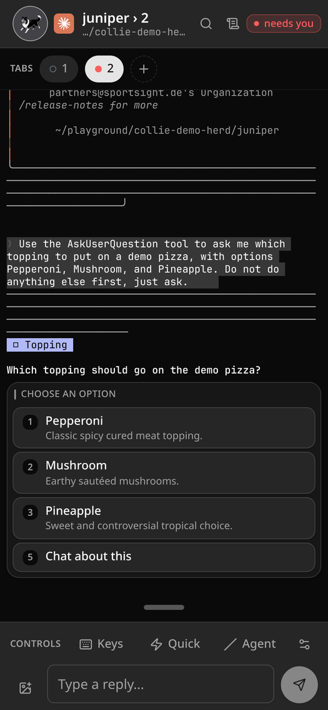

# Collie

<p align="center">
  
</p>

A phone web UI for your [Herdr](https://herdr.dev) agent herd, served over Tailscale. Open a URL, see
which agent is waiting on you, and answer it with your phone's keyboard.

The reply box is an ordinary text field, so your phone's own voice dictation works in it; Collie
ships none of its own.

- **React Router + Vite** — TypeScript, Tailwind, shadcn, and a Bun bridge
- **Runs on your own machine** — loopback bind, no cloud, no account
- **Your front door, your choice** — `tailscale serve` by default, or your own reverse proxy
- **Installs to your home screen** (PWA)

- **A dashboard ranked by who needs you**, not by what changed last
- **Push notifications** the moment an agent is waiting on you
- **Special-keys pad** — `Esc`, `Ctrl+C`, arrows, combinable modifiers
- **Slash-command palette** per agent — tap, don't type

- **Send an image** from your camera roll
- **Find in output** — search a pane, don't eyeball it
- **Conversation history** the terminal can't scroll back to — read from the agent's own session log
  (several agent homes? list them all in `COLLIE_TRANSCRIPT_ROOT`, comma-separated — see
  [`.env.example`](./.env.example))
- **Easily switch between Herdr sessions**

- **In the works** — more than one machine under a single URL: one Collie leads, the others join it

## Contents

- [Demo](#demo)
- [Security — read first](#%EF%B8%8F-security--read-before-you-run-it)
- [Requirements](#requirements)
- [Install](#install)
- [First run — what you'll see](#first-run--what-youll-see)
- [Configure](#configure)
- [Dark mode / light mode](#dark-mode--light-mode)
- [Commands](#commands) · [Herdr actions](#herdr-actions)
- [Update](#update-to-a-new-release)
- [Uninstall](#stop-or-uninstall)
- [Deployment variants](#deployment-variants)
- [Windows (experimental)](#windows-experimental)
- [Web Push](#web-push-optional)
- [Troubleshooting](#troubleshooting)
- [Architecture](#architecture)
- [Developing this plugin](#developing-this-plugin)

## Demo

A run through the herd from a phone: the dashboard floats the agent that **needs you** to the top,
you drill into a space's tabs and panes (long-press a pane pill or a tab chip to rename or close it —
and a Claude pane shows the name you gave it with `/rename`), answer an `AskUserQuestion` prompt with
a tap, switch between herds, and pick up a push notification the moment an agent is waiting on input.

<table>
  <tr>
    <td align="center" width="50%"><br><sub><b>Dashboard</b> — agents needing you float to the top</sub></td>
    <td align="center" width="50%"><br><sub><b>Ask</b> — Claude's own questions become tappable buttons</sub></td>
  </tr>
  <tr>
    <td align="center" width="50%"><br><sub><b>Space</b> — its tabs and panes, deep-linkable</sub></td>
    <td align="center" width="50%"><br><sub><b>Keys</b> — the special-keys pad, no chords to remember</sub></td>
  </tr>
  <tr>
    <td align="center" width="50%"><br><sub><b>Session switcher</b> — one bridge, every herd</sub></td>
    <td align="center" width="50%"><br><sub><b>Settings</b> — notifications, DND, diagnostics</sub></td>
  </tr>
</table>

## Motivation

I wanted to check on my agents from my phone. The usual route is [Termux](https://termux.dev) — SSH
in, attach to the terminal — but driving a TUI through its on-screen controls is miserable: the
special keys are fiddly, `Ctrl`/`Esc`/arrows are buried behind chords, and every reply is a fight
with the keyboard. I wanted something that feels like an app, not a terminal squeezed onto a
touchscreen: tap the agent that needs you, type with your real keyboard, fire `Esc` or `Ctrl+C` with
one thumb. Collie is that.

## Who is this for

You, if you run [Herdr](https://herdr.dev) agents on a machine and want to pick a session back up
from your phone. It assumes a **[Tailscale](https://tailscale.com) tailnet**: your phone and the host
are on the same tailnet, and `tailscale serve` is the only way in. It is **single-user** — one
operator, one tailnet, no multi-tenant auth. If you need shared or public access, Collie isn't built
for it. Read the security note below either way.

## ⚠️ Security — read before you run it

**Collie is remote shell access to your machine, by design.** One bridge call types arbitrary
keystrokes into a live terminal pane, so anyone who can reach the URL can read every pane (source,
secrets, env, agent output) and run any command as your user. No sandbox, no command allow-list
(that would defeat the purpose). Treat the URL like a root login.

Four sharp edges:

- **It acts as _you_**, with your full privileges — `~/.ssh`, `git push --force`, `rm -rf`, `sudo`.
- **It's reachable by every uid on the host, not just yours.** Herdr's socket is a file, so its
  permissions keep other local users out; Collie's port is TCP, so they're all in. An agent you
  deliberately ran as another user to contain it can still `curl 127.0.0.1:8787` and type into any
  pane. Set the device gate below if that uid boundary was your containment — but it gates **writes
  only**. Snapshots, pane output and transcript history stay readable by any local uid, so the gate
  bounds damage, not disclosure
  ([Variant B](#variant-b--identity-aware-proxy--per-device-authorisation),
  [ARCHITECTURE.md §6](./ARCHITECTURE.md#6-security-model)).
- **Access is device-level, not person-level.** Tailscale proves the device, not who's holding it.
  No password, no session — an unlocked or stolen phone (or anyone else on your tailnet) is an open
  shell. The idle-lock pauses an unattended screen and gates nothing — it is not auth, and never was
  ([ADR 0007](./.adr/0007-the-idle-lock-is-a-pause-not-a-gate.md)). Every write action (replies, keys, uploads, pane/tab
  create/close) is appended to `<state-dir>/audit.log`, so there is at least a trail — but a trail
  is not a gate.
- **One bridge fronts _every_ session.** With `COLLIE_MULTI_SESSION` on (the default), the bridge
  discovers and serves every named Herdr session under your config root — a private or sandbox
  session (e.g. `collie-demo`) is readable and drivable through the same URL as your primary, and the
  set is rescanned periodically. Set `COLLIE_MULTI_SESSION=0` to serve only the primary session.

It's built single-user and tailnet-only. The defenses:

- **Loopback bind only** (`127.0.0.1`) — never `0.0.0.0`.
- **Exactly one hardened front door** — either `tailscale serve` (default, Variant A: terminates
  TLS, injects the identity header) or a conforming reverse proxy
  ([Variant C](#variant-c--reverse-proxy-as-the-only-front-door-no-tailscale)). Never
  `tailscale funnel`, never a bare port.
- **Optional identity gate** — set `COLLIE_TRUSTED_USER` to reject any tailnet login but yours. It
  rejects a *mismatching* `Tailscale-User-Login` and passes an absent one, so it narrows who is
  trusted under `tailscale serve` (which always injects it) rather than mandating the header.
- **Optional per-device gate** — behind a proxy that injects a device-identity header, set
  `COLLIE_DEVICE_HEADER` + `COLLIE_DEVICE_ALLOWLIST` so only allowlisted devices can drive agents;
  any other device is read-only, and so is a request that arrives without the header at all. Off by
  default; revoke a device by dropping it from the list.
  See [Deployment variants](#deployment-variants) for the proxy this requires.
- **Same-origin gate + strict CSP**; pane output renders as React text nodes, never `innerHTML`.
- **Required remote Host allowlist** — set `COLLIE_PUBLIC_HOSTS` to every exact host or `host:port`
  you serve on (for example, your IP, FQDN, and MagicDNS name). Remote requests are denied when the
  list is empty. Values are canonicalized before exact comparison, allowed origins do not expand the
  list, and a loopback Host is accepted only from an actual loopback socket peer on a direct,
  non-forwarded request.

> 🚫 **Never `tailscale funnel` this** — funnel exposes it to the public internet; `serve` keeps it
> tailnet-only. There is no scenario where funneling Collie is correct.

Narrow the blast radius with Tailscale ACLs and `COLLIE_TRUSTED_USER`. Provided as-is, no warranty.

## Requirements

On the **host** (the tailnet node your agents run on):

| Tool | Why |
| --- | --- |
| [**Bun**](https://bun.sh) | Runs the bridge and builds the web UI — the only hard dependency. |
| [**Herdr**](https://herdr.dev) ≥ 0.7.0 | The herd Collie mirrors; its CLI registers the plugin. |
| [**Tailscale**](https://tailscale.com) | Front door for the default variant (`tailscale serve`); optional if you run [Variant C](#variant-c--reverse-proxy-as-the-only-front-door-no-tailscale) behind your own reverse proxy. Without any front door, the bridge is `127.0.0.1`-only. |
| **git** | Clone, and the `update` command. |

Soft dependencies: **Node.js** (the control script uses it to extract your MagicDNS name from
`tailscale status --json`; without it the banner falls back to the loopback URL) and a **service
supervisor** — `systemd --user` on Linux, **launchd** on macOS (both ship with the OS); a host with
neither falls back to an unsupervised `nohup` process. You never install JS
deps by hand — the build runs `bun install` for you; the backend imports only Bun + `node:*`.
[`web-push`](https://www.npmjs.com/package/web-push) is optional and lazy (see [Web
Push](#web-push-optional)).

**Linux and macOS are the supported hosts.** The bridge itself also runs on **Windows**
(experimental) against Herdr's Windows beta — see [Windows](#windows-experimental).

## Install

On the host, not your phone. Two ways in.

**From GitHub (turnkey)** — Herdr fetches and builds for you:

```bash
herdr plugin install AltanS/collie
herdr plugin action invoke start --plugin herdr.collie
```

**From a local clone (for development)** — registered by path:

```bash
git clone https://github.com/AltanS/collie.git && cd collie
herdr plugin link "$(pwd)"
herdr plugin action invoke start --plugin herdr.collie
```

They differ in *when* the UI builds — a GitHub install builds at install time (the manifest's
`[[build]]` step), a linked clone on first `start` — and in **what lands on disk**, which matters when
you go to [update](#update-to-a-new-release): `herdr plugin install` doesn't clone, it fetches one
commit and detaches onto it, so the checkout has no branch. Both shapes update fine from 0.23.1 on;
**installed earlier than that, see the note in [Update](#update-to-a-new-release)**. Either way,
`start` does four things:

1. **builds** `web/dist` if it's missing (typechecked, staged, swapped in atomically),
2. **starts the bridge** as the `systemd --user` service `collie` (`nohup` fallback without systemd),
3. **publishes it on the tailnet** — literally `tailscale serve --bg 8787`: HTTPS on the host's
   MagicDNS name, `:443 → 127.0.0.1:8787`, tailnet-only,
4. **prints the banner** with the URL to open — walked through line by line in
   [First run](#first-run--what-youll-see).

> No Herdr? Run `scripts/collie-ctl.sh start` directly — same effect (config then lives in
> `~/.config/collie/.env`).

## First run — what you'll see

The transcripts below are the control script's inline output. **Through `invoke start` you get
Herdr's JSON envelope instead** — the same text is the action's *captured stdout*, read with
`herdr plugin log list --plugin herdr.collie`.

```console
$ scripts/collie-ctl.sh start
building web UI (first run)…                    # linked clone only; a GitHub install already built
…bun install · typecheck · vite build output…
bridge started (systemd --user: collie)
tailscale serve (https) → tailnet :443 -> 127.0.0.1:8787

  ✓ Collie is running  ·  v0.15.0+174c4e4
    service   systemd --user (collie) · active
    local     http://127.0.0.1:8787
    tailnet   https://myhost.tail1234.ts.net
```

The `✓` is a real probe — the script connected to the bridge's port and got an answer, not just
"the unit is active". If you get `⚠ Collie isn't answering on :8787 yet` instead, see
[Troubleshooting](#troubleshooting).

### What just happened

`start` left three durable things on the host:

1. **`web/dist`** — the built UI. The bridge serves it from disk at request time, so later UI
   rebuilds go live without a restart.
2. **A supervised user service** — on Linux a `systemd --user` unit named `collie`, written to
   `~/.config/systemd/user/collie.service`, enabled and started, auto-restarting on failure. Inspect
   it with `systemctl --user status collie`. On macOS a launchd agent labelled `herdr.collie`, written
   to `~/Library/LaunchAgents/herdr.collie.plist` and bootstrapped into `gui/$(id -u)`; inspect it
   with `launchctl print gui/$(id -u)/herdr.collie`. (Neither supervisor? A `nohup` process with a
   pidfile in the config dir instead.)
3. **A tailnet-only `tailscale serve` mapping** — the script ran `tailscale serve --bg 8787`:
   HTTPS on the host's MagicDNS name, `:443 → 127.0.0.1:8787`. Tailscale terminates TLS (managed
   cert, nothing to obtain or renew) and injects the identity header the bridge checks. Inspect
   with `tailscale serve status`; remove just this mapping with `scripts/collie-ctl.sh unserve`.

`stop` merely pauses the service; `uninstall` reverses 2 + 3 and keeps your `.env` and the checkout.

### Open it on your phone

The URL is the banner's `tailnet` line (print it again anytime with `scripts/collie-ctl.sh url`).
It resolves for any device on your tailnet — so the phone needs the Tailscale app installed and
connected to the same tailnet as the host.

Rather than typing a MagicDNS name on a phone keyboard, **`scripts/collie-ctl.sh qr` prints it as a
QR code** you can point a camera at. It's its own subcommand rather than part of `start` because
Collie is a PWA: once it's on your home screen you never need the URL again.

Then install it as an app: **iOS** — Safari → share sheet → *Add to Home Screen*. **Android** —
Chrome → ⋮ menu → *Add to Home screen* (or *Install app*). Installing (and Web Push) needs the
HTTPS origin the default serve mode already provides; over `COLLIE_SERVE_MODE=http` the page works,
but service worker and install silently no-op.

#### Terminal appearance

Open a pane and tap the palette button in the **View** row to configure the terminal mirror's font
family, default foreground, and background. These preferences are stored in that browser's local
storage, so each phone or desktop browser can use its own appearance. The Matrix preset selects
`MesloLGS NF` with green (`#00ff00`) on black; explicit ANSI and Oh My Posh truecolor output still
take precedence. Custom fonts must already be installed on the device running the browser, because
Collie cannot inherit a Windows Terminal profile or load fonts from the host machine.

### Is it actually working?

A sixty-second check, host side then phone side:

```console
$ scripts/collie-ctl.sh status

  ✓ Collie is running  ·  v0.15.0+174c4e4
    service   systemd --user (collie) · active
    local     http://127.0.0.1:8787
    tailnet   https://myhost.tail1234.ts.net

  serve config:
    https://myhost.tail1234.ts.net (tailnet only)
    |-- / proxy http://127.0.0.1:8787
```

```console
$ scripts/collie-ctl.sh logs        # journal timestamps trimmed here
[push] disabled (no VAPID keys configured)
[bridge] listening on http://127.0.0.1:8787  (poll 1500ms)
[bridge] WARNING: COLLIE_TRUSTED_USER is empty — any tailnet device/user that reaches the bridge gets full write access. Set it to your tailnet login (see README → Variant A).
[bridge] WARNING: COLLIE_PUBLIC_HOSTS is empty — remote requests will be denied. Set it to each externally reachable host or host:port value.
```

**Both WARNINGs are expected on a fresh install.** The identity warning says who could control
Collie after ingress is configured; the Host warning means remote requests remain blocked until you
explicitly list their addresses. [Configure](#configure) both before publishing the bridge. (The
loopback URL in this example is correct: `127.0.0.1` is the default bind, and `tailscale serve`
publishes it without exposing the bridge directly.)

On the phone: your agents are listed, and the footer build stamp (`v0.9.0 · debcff9 · …`) matches
`scripts/collie-ctl.sh version`. If the page loads but stays empty, that's the same-origin gate —
see [Troubleshooting](#troubleshooting).

### Surviving reboots

A `systemd --user` service only runs while you have a login session. On a host that should serve
Collie unattended, enable lingering once:

```bash
loginctl enable-linger $USER
```

The unit is `enable`d, so with lingering it starts at boot with your user manager; the
`tailscale serve` mapping is persistent (`--bg`) and comes back on its own.

**On macOS there's nothing to enable.** `start` installs a launchd agent
(`~/Library/LaunchAgents/herdr.collie.plist`) with `RunAtLoad`, so the bridge comes back when you log
in and launchd restarts it if it exits abnormally. Inspect it with
`launchctl print gui/$(id -u)/herdr.collie`. It's a *LaunchAgent*, not a daemon, so it starts at
**login** rather than at boot — a Mac sitting at the login window is not serving Collie.

## Configure

Out of the box Collie runs **single-user and remote-deny-by-default**: loopback access works, but a
remote Host must be listed before the bridge will answer it. Once ingress is configured, anyone who
can reach an allowed Host has full control unless the identity gate is also configured. Address both
startup warnings in one sitting:

```bash
# in your .env
COLLIE_TRUSTED_USER=you@example.com                   # your tailnet login — the bridge rejects anyone else
COLLIE_PUBLIC_HOSTS=myhost.tail1234.ts.net,10.0.0.25:8787  # every exact remote host — blocks DNS rebinding
```

Config is a `.env` in the plugin's config dir — find it with
`herdr plugin config-dir herdr.collie` (typically `~/.config/herdr/plugins/config/herdr.collie`;
without Herdr, `~/.config/collie`). `collie-ctl.sh` resolves this same dir whether you run it
directly or via a Herdr action:

```bash
cp .env.example "$(herdr plugin config-dir herdr.collie)/.env"
```

The bridge reads `.env` only at startup — after any edit, `scripts/collie-ctl.sh restart`. See
[`.env.example`](./.env.example) for the full option list — commonly `COLLIE_PORT`, or
`COLLIE_SERVE_MODE=http` (Headscale / `.internal` domains; read by the control script when it runs
`tailscale serve`).

**Custom domain or reverse proxy?** See
[Variant C](#variant-c--reverse-proxy-as-the-only-front-door-no-tailscale) for the full reverse-proxy
front-door setup. The one rule to know here: Collie is same-origin only. A plain `tailscale serve` on
your MagicDNS name works as-is, but a different hostname or TLS terminator makes API calls fail with
`403 cross-origin` (page loads, stays empty). Allow the exact origin:

```bash
COLLIE_ALLOWED_ORIGINS=https://collie.example.com
```

## Dark mode / light mode

**Collie follows your phone by default.** Flip your device to dark at sunset and Collie goes with
it, no setting touched.

To pin it, open **Settings → Appearance** and pick **System**, **Light** or **Dark**. That's the
only place it lives — there is no header shortcut, because a theme is set once, and System already
does the situational flip for you.

The choice is **per device**, stored in the browser, not on the bridge: your phone can sit on Dark
while the laptop follows the OS. It survives reloads and reinstalls of the PWA on the same device.

### The terminal mirror is deliberately different

The mirror always renders on a **dark ground**, and light mode inverts the whole thing rather than
re-colouring it. That is not a shortcut — agents emit absolute colours (`38;2;r;g;b`) chosen for a
black terminal, and nothing downstream can re-theme them; dropped straight onto white, most of an
agent's output falls below 3:1. Inverting keeps the contrast the agent designed for. The full
measurement is in [ADR 0002](./.adr/0002-invert-the-light-terminal-mirror.md).

Two things follow that are worth knowing:

- **Keep your agents on a dark theme** — the default for Claude Code, codex, opencode and pi. An
  agent set to a *light* theme emits dark-on-light colours, which are unreadable in Collie under
  either appearance. This is a property of what the agent sends, not of Collie's rendering.
- **Diffs and highlighted rows show as dark blocks** in light mode. Legibility is unaffected; only
  the visual weight flips.

> **Installed on iOS?** In light mode the status-bar text stays white and can disappear against the
> page. iOS gives web apps no way to change this at runtime — use the browser rather than the
> installed app if it bothers you.

## Commands

Every command works two ways: the **control script** on the host (`scripts/collie-ctl.sh <cmd>`) or
the equivalent **Herdr action** (`herdr plugin action invoke <cmd> --plugin herdr.collie`, written
below as `invoke <cmd>`). The ones you'll actually use:

| Action | Control script | Herdr action |
| --- | --- | --- |
| **Start** — build if needed, serve, print the URL | `collie-ctl.sh start` | `invoke start` |
| **Stop** — pause the bridge; removes nothing | `collie-ctl.sh stop` | `invoke stop` |
| **Restart** | `collie-ctl.sh restart` | `invoke restart` |
| **Status** — the *Collie is running* banner + URLs | `collie-ctl.sh status` | `invoke status` |
| **URL** — print the tailnet URL | `collie-ctl.sh url` | `invoke url` |
| **QR** — the same URL as a scannable code | `collie-ctl.sh qr` | — (script only) |
| **Version** — the running version (`0.x.y+sha`) | `collie-ctl.sh version` | `invoke version` |
| **Update** — advance the checkout + rebuild + restart | `collie-ctl.sh update` | `invoke update` |
| **Uninstall** — remove the service; keep `.env` + checkout | `collie-ctl.sh uninstall` | `invoke uninstall` |
| **Logs** — tail the journal / log file | `collie-ctl.sh logs` | — (script only) |

`start` and `status` end with the **Collie is running** banner — annotated line by line in
[First run](#first-run--what-youll-see). Its version comes from the *served* bundle stamp, so it's
the authoritative "what's running" — note `herdr plugin list --json` shows a different value cached
at `plugin link` time; for a linked clone `update` re-links automatically so that self-heals (to
force it: `herdr plugin link "$(pwd)"`), and on Herdr ≥0.8.0 the manifest is re-read from disk
anyway. **Through a Herdr action you get Herdr's JSON envelope, not the
banner** — the human-readable output is the action's *captured stdout*, read with
`herdr plugin log list --plugin herdr.collie` (or run the control script directly to see it inline).
`build` · `serve` · `unserve` are script-only too.

### Herdr actions

Collie registers these actions in `herdr-plugin.toml`; invoke any with
`herdr plugin action invoke <id> --plugin herdr.collie` (list them live with
`herdr plugin action list --plugin herdr.collie`):

| `<id>` | Title | What it does |
| --- | --- | --- |
| `start` | Start web bridge | Build if needed, start the service, `tailscale serve`, print URL + banner |
| `stop` | Stop web bridge | Pause the bridge; removes nothing |
| `restart` | Restart web bridge | `stop` + `start` |
| `status` | Bridge status | The *Collie is running* banner — readiness ✓/⚠, version, URLs |
| `url` | Show bridge URL | Print the tailnet URL |
| `version` | Show version | Print the running version (`0.x.y+sha`) |
| `update` | Update plugin | Advance the checkout (pull, or fetch + re-detach) + rebuild + restart |
| `uninstall` | Uninstall web bridge (remove service) | Tear down the service (keeps `.env` + checkout) |

## Manage & update

### Stop or uninstall

Pause the bridge without removing anything (a later `start` brings it right back):

```bash
scripts/collie-ctl.sh stop      # or: herdr plugin action invoke stop --plugin herdr.collie
```

To tear the service down completely — stop + disable it, remove the service definition (the
`systemd --user` unit, or the launchd agent plist on macOS), and remove
Collie's own `tailscale serve` mapping (port-scoped, so other tailnet mappings on the host survive) —
use `uninstall`. It leaves your `.env` and the checkout untouched:

```bash
scripts/collie-ctl.sh uninstall # or: herdr plugin action invoke uninstall --plugin herdr.collie
```

Then `herdr plugin uninstall herdr.collie` (or, for a linked clone, just deleting the directory)
removes the plugin registration itself.

### Update to a new release

The checkout *is* the plugin, and Herdr has no `plugin update` of its own. One command does the lot:

```bash
scripts/collie-ctl.sh update    # or: herdr plugin action invoke update --plugin herdr.collie
```

It advances the checkout, rebuilds the UI and restarts the bridge (re-execing itself, so it's safe
even when the update rewrites the script). Confirm via the footer build stamp.

#### If that fails with *"You are not currently on a branch"*

You installed from GitHub before **0.23.1**, when `update` assumed every checkout was a clone
([#63](https://github.com/AltanS/collie/issues/63)). `herdr plugin install` doesn't clone — it fetches
one commit and detaches onto it — so `git pull` had nothing to pull into, and no version installed
that way could ever self-update. The fix ships *inside* the checkout it repairs, so take it with one
reinstall; `update` works normally from then on:

```bash
herdr plugin install AltanS/collie --yes          # replaces the checkout, rebuilds the UI
herdr plugin action invoke restart --plugin herdr.collie   # reinstall doesn't restart the service
herdr plugin action invoke version --plugin herdr.collie   # expect 0.23.1 or newer
```

Your `.env` and `tailscale serve` state live in the plugin config dir, outside the checkout, so they
survive. Pinned to a version with `--ref`? Keep refreshing with `herdr plugin install --ref …` —
`update` always goes to the latest.

#### What `update` actually does to the checkout

Two install paths, two on-disk shapes, one command across both — the reasoning, and what it costs, is
[ADR 0006](./.adr/0006-update-advances-the-checkout-herdr-installed.md):

- **Linked clone** (on a branch) — `git pull --ff-only`, then **re-links the plugin** so Herdr picks
  up any new actions and the new version.
- **`herdr plugin install`** (detached, shallow) — fetches the default-branch tip and re-detaches onto
  it. `--depth 1` only if it's already shallow, so a full history is never truncated; `--force` so a
  lockfile the build rewrote can't wedge the *next* update. It deliberately does **not** re-link:
  linking re-registers the plugin as a local path, after which Herdr refuses `herdr plugin install` —
  the reinstall above, which is your recovery path if this checkout ever breaks again.

By hand: frontend (`web/`) → `collie-ctl.sh build` (live, no restart — served from disk); backend
(`bridge/`) → `systemctl --user restart collie`. Run `scripts/install-hooks.sh` once to enable the
repo's pre-commit / pre-push checks.

## Deployment variants

The bridge always binds **loopback only**; what changes between deployments is *what sits in front
of it* and *how a request proves who it is*. Five supported shapes — Tailscale by **person** (A),
a co-located proxy by **device** (B), a reverse proxy as the sole front door (C), an **off-host**
identity proxy reached over the tailnet (D), or any other mesh or tunnel
([E](#variant-e--any-other-mesh-or-tunnel-netbird-zerotier-cloudflare-tunnel)). Pick one.

### Variant A — `tailscale serve` + person identity (default)

The happy path from [Install](#install). `tailscale serve` terminates TLS on your MagicDNS name and
injects `Tailscale-User-Login`; set `COLLIE_TRUSTED_USER` to your tailnet login and the bridge
rejects anyone else.

```bash
# in your .env
COLLIE_TRUSTED_USER=you@example.com
```

- **Granularity:** the tailnet *person*, not the device.
- **Why it's safe on bare `tailscale serve`:** serve is the *trusted injector* of
  `Tailscale-User-Login` — it sets that header itself and a client can't forge it through the proxy.
- Nothing else to configure; origins match automatically on the MagicDNS name.

This is the right choice unless you specifically need per-device control.

### Variant B — identity-aware proxy + per-device authorisation

Use this when some devices should **drive** agents and others should be **read-only** — e.g. your
phone can reply, but a shared/less-trusted device can only watch. Collie reads an opaque device id
from a request header (`COLLIE_DEVICE_HEADER`) and checks it against `COLLIE_DEVICE_ALLOWLIST`:
allow-listed → full access, any other id → read-only, header absent → read-only as well.

Treating an absent header as read-only is the point: switching this on is you asserting that your
proxy sets the header on every request, so a request without one did not come through that proxy and
must not drive a terminal. **Device-auth only works behind a reverse proxy that authenticates the
device and injects the header.** It is not a standalone flag.

Note what "read-only" means here: the gate covers writes (replies, keys, uploads, pane and tab
create/close). Reading panes, polling the snapshot and listing sessions stay open to any caller that
gets past the same-origin and Host checks, exactly as they do for a device that is simply not on the
allowlist. Pane text can contain anything your agents printed, so the header is not a confidentiality
boundary.

Two consequences worth knowing before you turn this on:

- **The bridge's own loopback URL becomes read-only.** `http://127.0.0.1:$COLLIE_PORT` bypasses your
  proxy, so the PWA loaded from it sends no device header and shows its read-only state. Drive the
  herd through the proxied URL instead.
- **To drive a pane from the host by hand**, send an allowlisted id yourself, against the loopback
  bridge rather than the public URL (the proxy's mandatory override in point 2 below would replace
  your header): `curl -H 'X-Device-Id: my-laptop' http://127.0.0.1:$COLLIE_PORT/api/...`

> ⚠️ **Do not enable `COLLIE_DEVICE_HEADER` on plain `tailscale serve`.** `tailscale serve` injects
> only its own `Tailscale-*` headers and *forwards* an arbitrary `X-Device-Id` untouched, so a
> client that *sets* `X-Device-Id: my-phone` itself is trusted. Spoofing is what makes this unsound,
> and only a proxy that **overrides** the header (point 2 below) closes it.

Your fronting proxy **must**:

1. **Authenticate the device** by some means it controls — mTLS client certs, an SSO/forward-auth
   layer (oauth2-proxy, Pomerium, Cloudflare Access), Tailscale node identity, etc. How you derive a
   stable per-device id is up to you; Collie treats it as opaque.
2. **Set (override) the device header** on *every* upstream request — never merely add it, so any
   client-supplied copy is discarded. This override is what makes the header trustworthy.
3. **Proxy to the bridge on loopback** (`127.0.0.1:$COLLIE_PORT`). The loopback bind is the trust
   anchor — nothing but the proxy can reach the bridge to set the header.
4. **Satisfy the same-origin gate.** Collie accepts a request when the browser's `Origin` host
   equals the `Host` the bridge receives. So either **forward the public `Host` unchanged**, or — if
   your proxy rewrites Host — list the exact public origin in `COLLIE_ALLOWED_ORIGINS`. Otherwise
   every API call 403s `cross-origin rejected` (the page loads but stays empty).

Collie side (`.env`):

```bash
COLLIE_HOST=127.0.0.1                       # keep loopback (default)
COLLIE_DEVICE_HEADER=X-Device-Id            # the header your proxy injects
COLLIE_DEVICE_ALLOWLIST=my-phone,my-laptop  # ids allowed to drive agents; others → read-only
# COLLIE_ALLOWED_ORIGINS=https://collie.example.com   # only if the proxy does NOT forward the public Host
# COLLIE_TRUSTED_USER still composes on top if your ingress also injects Tailscale-User-Login
```

Illustrative nginx — the auth layer is yours; the load-bearing lines are the **override** and the
**loopback** `proxy_pass`:

```nginx
location / {
    # $device_id comes from your auth (client-cert CN, auth_request, SSO header, …).
    # SETTING it replaces any client-supplied X-Device-Id — that's what kills spoofing.
    proxy_set_header X-Device-Id $device_id;
    proxy_set_header Host        $host;       # forward the public Host → same-origin gate passes
    proxy_pass http://127.0.0.1:8787;
}
```

Revoke a device by dropping its id from `COLLIE_DEVICE_ALLOWLIST` and restarting
(`herdr plugin action invoke restart --plugin herdr.collie`). With the header set but the allowlist
**empty**, every device is read-only (fail-closed), and so is a request that arrives without the
header. In that state nothing can drive a pane, including a hand-made `curl`; recovery is an `.env`
edit plus a restart.

This variant assumes the proxy is **on the same host**, reaching the bridge on loopback. If your
proxy runs on a *different* node and its upstream is the bridge's own `tailscale serve` URL, the
trust story changes — see [Variant D](#variant-d--off-host-identity-proxy-over-the-tailnet).

### Variant C — reverse proxy as the only front door (no Tailscale)

A reverse proxy (Caddy, Nginx, …) is the **sole ingress** — no Tailscale in the path. Choose this
when the host isn't on a tailnet, or when you already run a TLS-terminating proxy with its own access
control (SSO, mTLS, a VPN gateway) and want Collie behind it like any other upstream.

Set `COLLIE_SKIP_SERVE=1` so `collie-ctl.sh start` builds, starts and supervises the bridge but
**never touches `tailscale serve`** — the proxy owns ingress. The bridge still binds loopback only;
your proxy reaches it on `127.0.0.1:$COLLIE_PORT`.

The **four proxy requirements from
[Variant B](#variant-b--identity-aware-proxy--per-device-authorisation) apply verbatim** — the proxy
*is* the identity-aware front door here. A minimal Caddy front door:

```caddyfile
collie.example.com {
    # TLS is automatic (Let's Encrypt). Put YOUR access control here
    # (forward_auth / mTLS / SSO) — it also yields the per-device id below.
    reverse_proxy 127.0.0.1:8787 {
        header_up X-Device-Id {your_device_id}   # SET from your auth — overrides any client-supplied copy
        header_up Host {host}                     # forward the public Host → same-origin gate passes
    }
}
```

Required env (`.env`):

```bash
COLLIE_SKIP_SERVE=1                                 # proxy is ingress; never run tailscale serve
COLLIE_PUBLIC_HOSTS=collie.example.com              # Host allowlist — blocks DNS rebinding
COLLIE_ALLOWED_ORIGINS=https://collie.example.com   # exact public origin for the same-origin gate
COLLIE_DEVICE_HEADER=X-Device-Id                    # the header your proxy injects…
COLLIE_DEVICE_ALLOWLIST=my-phone,my-laptop          # …and the ids allowed to drive; others → read-only
# COLLIE_PUBLIC_URL=https://collie.example.com      # optional — shown in the collie-ctl.sh status banner
```

> ⚠️ **`COLLIE_TRUSTED_USER` does nothing here.** It gates on `Tailscale-User-Login`, which only
> `tailscale serve` injects — with no Tailscale in the path there is no injector, so the check has
> nothing to compare against and every request passes it. It fails *open*, not closed, and the bridge
> logs a startup warning saying so. **Per-device auth (`COLLIE_DEVICE_HEADER`) is the write gate**,
> and the **proxy must provide TLS and its own access control** — anyone who reaches the proxy gets
> read access to every pane. Give the proxy the same respect you'd give the tailnet.

**Caching: respect the origin's `Cache-Control` — never blanket-cache.** The bridge marks hashed
assets (`/assets/*`) immutable and everything else (notably `/sw.js` and `index.html`) `no-cache`.
A proxy cache that ignores this and holds onto `/sw.js` starves installed PWAs of updates
indefinitely — clients keep running old code with no way to notice. If your proxy adds caching,
honor origin headers (Caddy and stock Nginx `proxy_cache` do by default; CDNs often need it
enabled explicitly).

**Serve your sign-in page under `/auth/`.** Collie reserves that path for you and routes nothing
there. It matters because of how an installed PWA behaves: the service worker answers every
navigation it owns from the precached app shell without touching the network, and there is no
address bar to work around it. So a proxy page served anywhere Collie owns — including `/` — is
invisible to the installed app, and a reload just re-renders the refused UI. `/auth/` (and anything
beneath it) is the one path the service worker always passes through, so it is the only address that
reaches you. When the bridge answers there itself, nothing claimed the path — that placeholder is
your signal that the proxy rule is missing.

```caddyfile
collie.example.com {
    handle /auth/* {
        # your sign-in / device-enrolment flow, exempt from the auth check that guards the rest
        reverse_proxy 127.0.0.1:9091
    }
    handle {
        forward_auth 127.0.0.1:9091 { ... }
        reverse_proxy 127.0.0.1:8787 { ... }
    }
}
```

Collie's refusal banner links to `/auth/` when the bridge or your proxy answers 401/403, so a
signed-out phone has a tappable way back in. A `?rd=`/`?next=` return-to parameter on the redirect is
fine — the passthrough matches the query string too. If your flow lives at a path you can't move,
redirect `/auth/` to it; the redirect is followed on the network side, where the service worker isn't
looking. Cloudflare Access is the exception that can't be redirected, since it owns `/cdn-cgi/access/`
outright — that prefix is reserved as well, so its flow works untouched.

> ⚠️ **Let the static bundle through even when the session has lapsed** — everything except `/api/`
> and page navigations. It is public client code with no secrets in it, and it is the only way an
> installed app can receive an update. If your proxy refuses `/sw.js` to a signed-out client, that
> client's service worker can never be replaced: `registration.update()` fails outright, so a device
> that lapsed while running an old build stays on that build forever. Measured, not theorised — with
> the bundle refused, `update()` throws; with it allowed, the worker updates cleanly while `/api/` is
> still answering 401.
>
> This bites hardest on the very fix described above: a device that was already locked out **before**
> upgrading to 0.18.0 cannot pick up the new service worker, and its `/auth/` link won't exist. Those
> devices need their site data cleared once (browser settings → the site → clear data), then a fresh
> load. New installs and any device that updated while signed in are unaffected.

### Variant D — off-host identity proxy over the tailnet

Choose this when you already run a **central ingress node** for your tailnet — one forward-auth/SSO
layer, one wildcard cert, a row of services behind it — and you want Collie to be another entry in
that table rather than a second auth stack configured on the agent host.

The proxy is on a *different machine*, so it can't reach the bridge on loopback. The agent host
publishes the bridge **tailnet-only** with `tailscale serve --http`, and the proxy's upstream is that
tailnet URL:

```
  phone ──── https ────► ingress node          TLS + forward-auth; SETS the device header
                            │
                            │  http, never leaves the tailnet (WireGuard encrypts it)
                            ▼
                        host.your-tailnet.ts.net:8787     tailscale serve --http, tailnet-only
                            │
                            ▼
                        127.0.0.1:8787                    the bridge
```

Plain HTTP on the middle hop is fine *because it rides the tailnet* — TLS terminates at the proxy.
That is not the same thing as serving Collie over plain HTTP publicly, which is what the
`COLLIE_SERVE_MODE=http` warnings elsewhere are about.

The **four proxy requirements from
[Variant B](#variant-b--identity-aware-proxy--per-device-authorisation) apply**, except (3): proxy to
the host's tailnet URL rather than `127.0.0.1`.

> ⚠️ **A Tailscale ACL is mandatory in this variant.** The bridge's tailnet URL has to stay reachable
> or the proxy couldn't reach it either, so there is a permanent second path to the bridge that skips
> your forward-auth entirely — and **`tailscale serve` forwards a client-supplied device header
> untouched** (verified: it arrives at the bridge unmodified). Your proxy's mandatory *override* only
> protects the proxy path; on the direct path there is no override, so a tailnet peer who supplies an
> allow-listed id gets full write access. Device ids are human-readable names, so treat them as
> guessable, not secret. **Restrict who can reach the port at all.**
>
> On Tailscale (or headscale ≥ 0.29), `grants`:
>
> ```jsonc
> "grants": [
>   { "src": ["tag:ingress"], "dst": ["tag:agent-host"], "ip": ["tcp:8787"] },
> ]
> ```
>
> On **headscale ≤ 0.28** `grants` does not exist, and an unparseable policy will take the control
> plane down rather than fail safe — use the older `acls:` form. Tags may not be an option either:
> 0.28 makes tag ownership and user ownership mutually exclusive, so tagging a node can detach it from
> its user. Name the nodes or users directly instead:
>
> ```yaml
> acls:
>   - action: accept
>     src: ["ingress-node"]
>     dst: ["agent-host:8787"]
> ```
>
> **Adding that rule is not enough on its own.** These policies are default-deny, so a broad rule you
> already have (`dst: ["agent-host:*"]`) will keep the port open to everyone it covers. The port has
> to be *carved out* of the broader grant, which in practice means splitting the range:
>
> ```yaml
>   - action: accept
>     src: ["my-phone", "my-laptop"]
>     dst: ["agent-host:1-8786", "agent-host:8788-65535"]   # everything EXCEPT the bridge
> ```
>
> Per-device auth is still required, and it does real work: since 0.15.0 a request arriving *without*
> the header is read-only, so a stray client, another service or the host's own loopback URL can watch
> but never drive. What it cannot do is stop a caller who deliberately sets the header. The ACL is
> what stops that, and the two together are the posture.

**Host and Origin are different values here** — the one place this trips people up. `tailscale serve`
Host-routes on the host's own MagicDNS name, so the proxy generally must rewrite `Host` to the
upstream (in Traefik, `pass_host_header: false`). The bridge then sees the *tailnet* Host while the
browser's Origin is your *public* name, so the two settings take different values:

```bash
COLLIE_SERVE_MODE=http                                # proxy terminates TLS; this hop is tailnet-internal
COLLIE_HOST=127.0.0.1                                 # keep loopback (default)
COLLIE_DEVICE_HEADER=X-Tailnet-Device                 # header your forward-auth injects — REQUIRED here
COLLIE_DEVICE_ALLOWLIST=my-phone,my-laptop            # ids allowed to drive; others + header-less → read-only
COLLIE_PUBLIC_HOSTS=host:8787,host.your-tailnet.ts.net:8787   # the Host the proxy forwards
COLLIE_ALLOWED_ORIGINS=https://collie.example.com     # the public origin the browser actually uses
```

> **`COLLIE_TRUSTED_USER` is not a person gate in this shape.** `tailscale serve --http` *does* still
> inject `Tailscale-User-Login`, but it names the **calling node's owner** — through the proxy that's
> the ingress node, identically on every request no matter who is holding the phone. It remains
> useful for rejecting nodes owned by a *different* tailnet user (shared machines), so it is worth
> setting; it just cannot tell your own devices apart. The device header does that.

**Is it actually working?** Two controls are doing the work here — the ACL decides *who reaches the
port*, the device gate decides *what a request that got there may do* — and each has to be tested
from a machine that can actually observe it.

**From a tailnet peer** (your phone, a laptop — anything that is neither the ingress node nor the
agent host):

```console
$ curl -s https://collie.example.com/api/snapshot | jq -c .device
{"enforced":true,"device":"my-phone","authorized":true}

$ curl -s --max-time 10 -H 'X-Tailnet-Device: my-phone' http://host.your-tailnet.ts.net:8787/api/snapshot
curl: (28) Connection timed out
```

The first proves the proxy injects the header *and* that the id is allow-listed. The second is the
one people skip: it must **fail to connect**. A reply of any kind means that peer reached the port
directly, and since the header is forgeable there, your forward-auth is decoration for anyone who
bothers.

**On the agent host** (where the port is reachable by definition, so the gate is what's under test):

```console
$ curl -s http://127.0.0.1:8787/api/snapshot | jq -c .device
{"enforced":true,"device":null,"authorized":false}
```

A header-less request must be read-only. **If it says `"authorized":true`, your bridge predates
0.15.0** — update before going further.

> ⚠️ **Don't test reachability from the agent host.** A connection to your own tailnet IP is handled
> locally and never crosses the peer packet filter, so `curl http://host.your-tailnet.ts.net:8787`
> succeeds *there* even when the ACL is flawless. It is the most obvious machine to test from, since
> it's the one you're configuring, and it will tell you your ACL is broken when it isn't. Reachability
> is only observable from a second device.

### Variant E — any other mesh or tunnel (NetBird, ZeroTier, Cloudflare Tunnel)

Tailscale is the **default**, not a requirement. Collie's own Tailscale coupling is one header read
and a convenience in `collie-ctl.sh`; the bridge itself is a loopback HTTP server that gates on
`Host`, `Origin`, and two optional headers. Anything that can reach `127.0.0.1:$COLLIE_PORT` can
front it.

Collie deliberately **manages** only one front door — the one this project runs and tests. For every
other tunnel you own the ingress and Collie stays out of the way:

```bash
COLLIE_SKIP_SERVE=1                                 # never run tailscale serve
COLLIE_PUBLIC_HOSTS=collie.example.com              # exact public host — blocks DNS rebinding
COLLIE_ALLOWED_ORIGINS=https://collie.example.com   # exact public origin for the same-origin gate
```

Then point your tunnel at `127.0.0.1:$COLLIE_PORT` and start it however you start your other
services. `netbird expose 8787`, a ZeroTier-routed reverse proxy and `cloudflared tunnel` all work
this way. `collie-ctl.sh start` will build, launch and supervise the bridge and publish nothing;
`unserve` and `uninstall` likewise leave your tunnel alone, exactly as under
[Variant C](#variant-c--reverse-proxy-as-the-only-front-door-no-tailscale).

Three things to get right, none of them Collie-specific:

1. **The [Variant B](#variant-b--identity-aware-proxy--per-device-authorisation) proxy requirements
   apply verbatim.** Loopback upstream, the public `Host` forwarded unchanged (or listed in
   `COLLIE_ALLOWED_ORIGINS`), and — if you use the device gate — the identity header **overridden**
   on every request, never merely added.
2. **`COLLIE_TRUSTED_USER` does nothing here**, for the reason it does nothing behind a reverse proxy
   ([Variant C](#variant-c--reverse-proxy-as-the-only-front-door-no-tailscale)): nothing injects
   `Tailscale-User-Login`, so the check passes every request rather than blocking it, and the bridge
   warns about that at startup. If your tunnel authenticates and injects a device identity, use
   `COLLIE_DEVICE_HEADER` + `COLLIE_DEVICE_ALLOWLIST` instead; if it authenticates but injects
   nothing, its own auth *is* the whole gate and anyone who passes it gets full Collie access.
3. **Pin a stable hostname before you install the PWA.** A service-worker cache is per-origin, and
   several tunnels hand out a fresh generated name per session. A name that changes gives you a new
   install each time and makes `COLLIE_PUBLIC_HOSTS` unpinnable.

> ⚠️ **Anything that publishes to the open internet is a `funnel` by another name.** The rule in
> [Security](#%EF%B8%8F-security--read-before-you-run-it) isn't about Tailscale, it's about
> reachability: this socket is a shell running as you. If your tunnel offers a public URL, the auth
> in front of it is the only thing between a stranger and that shell, so treat a shared PIN the way
> you'd treat a root password — and prefer a tunnel scoped to your own devices over a public URL
> with a gate on it.

## Windows (experimental)

The **bridge** runs on Windows against Herdr's Windows beta; the **launcher** does not. Herdr there
exposes its control socket as a *named pipe* named after the full socket path, not an AF_UNIX
socket, so Collie dials it through `node:net` instead of `Bun.connect` — one shim,
[`bridge/dial.ts`](./bridge/dial.ts), which explains the mapping at the top of the file.

What that means in practice:

- **Run the bridge directly** — `bun run bridge/index.ts`. There's no systemd unit, and the Herdr
  action buttons shell out to `bash`, so they only work if Git Bash is on `PATH`. The manifest
  therefore still declares `linux`/`macos` only, rather than advertising buttons that may not fire.
- **`tailscale serve` isn't wired up here.** Use the [Variant C](#variant-c--reverse-proxy-as-the-only-front-door-no-tailscale)
  posture: loopback bind, your own ingress in front, `COLLIE_PUBLIC_HOSTS` pinned. The security
  rules in [§Security](#%EF%B8%8F-security--read-before-you-run-it) are not relaxed on Windows.
- **Set `COLLIE_MULTI_SESSION=off`** — session discovery derives POSIX paths.
- The socket path defaults to `%APPDATA%\herdr\herdr.sock`; override with `HERDR_SOCKET_PATH`
  (an explicit `\\.\pipe\…` value is passed through untouched).

**Want the lifecycle too?** The bridge has spoken Windows' named pipe since 0.15.0; a
community-maintained Task Scheduler setup (start/stop/update, no supported-tree guarantees) lives in
[`contrib/windows/`](./contrib/windows/README.md).

**Is it actually working?** The bridge logs `[events] stream up` on start — the event stream works
over the pipe, so Windows gets the same live updates as Linux, not degraded polling.

`COLLIE_HERDR_DIAL=net` forces that same dialer on Linux/macOS. It exists so the Windows code path
can be exercised — and regression-tested — without a Windows box; `bridge/dial.test.ts` uses it.

## Web Push (optional)

Off unless you opt in:

```bash
bun add web-push
bunx web-push generate-vapid-keys
# set COLLIE_VAPID_PUBLIC / _PRIVATE / _SUBJECT in your .env, then restart
```

Push needs a **secure context (HTTPS)**, which any HTTPS-terminating front door provides — the
default `tailscale serve` (Tailscale manages the MagicDNS cert; nothing to obtain or renew) or a
[Variant C](#variant-c--reverse-proxy-as-the-only-front-door-no-tailscale) proxy that terminates TLS.
Plain-HTTP modes (`COLLIE_SERVE_MODE=http`) are **not** a secure context, so push silently won't fire
there — Settings flags it `insecure`.

Collie pushes when an agent goes **blocked** or **done**, with the agent's message in the body;
**tapping it opens Collie at that agent**. Test it without waiting for an agent to block:

```bash
bash scripts/collie-ctl.sh push-test                 # or: push-test "Title" "Body"
```

## Troubleshooting

**`herdr plugin …` fails with `Error: Os { code: 2, kind: NotFound, message: "No such file or
directory" }`.** This is *not* a Collie problem — it means the **Herdr server isn't running**, so its
CLI can't reach the control socket (`~/.config/herdr/herdr.sock`). The tell is the *raw* `Os {…}`
error: a reachable server answers path/manifest problems with structured JSON (e.g.
`plugin_manifest_not_found`), so a bare `Os { NotFound }` is a failed socket connect, before Collie
or your path is ever examined. It hits `link`, `install`, `action invoke` — every subcommand that
talks to the server — while `herdr plugin --help` still works (it never opens the socket). Fix: start
Herdr first (`herdr server &`, or just launch the Herdr TUI — it boots the server), confirm
`ls ~/.config/herdr/herdr.sock` now exists, then retry the install. `herdr plugin list` is a quick
probe: if it throws the same error, the server is down.

**`update` fails with `You are not currently on a branch`.** A GitHub install made before **0.23.1**
([#63](https://github.com/AltanS/collie/issues/63)). `herdr plugin install` fetches one commit and
detaches onto it rather than cloning, so the old `update` — which ran `git pull` — had no branch to
pull into, and no install of that vintage could refresh itself. The fix ships inside the checkout it
repairs, so it takes one reinstall to land:
[Update to a new release](#update-to-a-new-release) has the three commands.

**`start` prints `note: tailscale serve failed`.** The bridge itself is fine (still up on
`127.0.0.1`) — only the tailnet ingress didn't come up, and the script prints tailscale's own error
right below the note. Usual causes: your user isn't the Tailscale operator
(`sudo tailscale set --operator=$USER`), the node is logged out (`tailscale up`), or — on
Headscale / `.internal` tailnet domains — HTTPS certs aren't available, which is exactly what
`COLLIE_SERVE_MODE=http` is for: set it in `.env`, then `scripts/collie-ctl.sh restart`. Verify with
`tailscale serve status`.

**Banner shows `⚠ Collie isn't answering on :8787 yet`.** The service was started but the HTTP
server isn't answering the probe. `scripts/collie-ctl.sh logs` (or `journalctl --user -u collie -f`
to watch live) says why — most commonly the port is already taken (set `COLLIE_PORT` in `.env`, then
`scripts/collie-ctl.sh restart`, which also re-runs `tailscale serve` against the new port) or the
first build failed (the log says so; fix and run `scripts/collie-ctl.sh build`). The unit
auto-restarts every 5 s, so once the cause is fixed it usually comes back on its own.

**Phone can't open the tailnet URL.** Work down the list: (1) the phone runs the Tailscale app and
is *connected* to the same tailnet as the host; (2) you're opening the banner's `tailnet` URL
(`scripts/collie-ctl.sh url`), not the `local` one — `http://127.0.0.1:8787` only works on the host
itself; (3) MagicDNS is enabled in your tailnet's DNS settings (the URL is a MagicDNS name); (4) the
host is online — check `tailscale status` on the host, or ping the host from the phone's Tailscale
app; (5) **your tailnet policy actually admits a peer to this node** — if it doesn't, the banner now
says so under the `tailnet` line, and nothing else will: the front door is published correctly, the
cert is valid, and `curl` from the host itself returns 200, because loopback never touches the packet
filter. Two things make this one especially misleading — `tailscale ping` **succeeds** (disco pings
bypass ACLs), and blocked traffic is dropped rather than refused, so the phone just hangs and reads
as "server down". Fix it in your ACL policy (<https://login.tailscale.com/admin/acls> on Tailscale;
your policy file on Headscale). The check is best-effort and deliberately unsure of itself: it speaks
up only when this node's filter admits *nothing* — which can equally mean no other device has joined
the tailnet yet — and stays quiet whenever it can't tell.

**Page loads but stays empty; API calls fail `403 cross-origin rejected`.** You're reaching Collie
through an origin the bridge doesn't expect — a custom domain, or a proxy that rewrites `Host`.
Allow the exact public origin with `COLLIE_ALLOWED_ORIGINS` (see [Configure](#configure)), or make
the proxy forward `Host` unchanged (Variant B, rule 4).

**Collie is gone after a reboot.** A `systemd --user` unit only runs while you have a session — on a
headless host enable lingering once (`loginctl enable-linger $USER`) and the `collie` unit (already
`enable`d) starts at boot with your user manager. The `tailscale serve` mapping persists on its own
(`--bg`), so lingering is usually the whole fix. On macOS the launchd agent starts at **login**, so
check you're actually logged in (not sitting at the login window) and that the agent is loaded:
`launchctl print gui/$(id -u)/herdr.collie`.

**Phone shows a stale UI after a rebuild.** A PWA's service-worker cache is per-origin, so reaching
Collie at two origins (a custom domain *and* the raw `host:8787`) gives you two installs, each
caching its own bundle. The footer **build stamp** (`vX.Y.Z · sha · time`) shows the bundle you're
running; the bridge reports what it serves via the `X-Collie-Build` header and `/api/config`. On a
mismatch, the footer offers **"new build — tap to update."** Otherwise reopen the PWA a couple times
(the SW auto-updates) or clear that origin's site data. Best practice: **pick one HTTPS origin and
stick to it.** (Over plain HTTP the SW can't register — always fresh, but no PWA features.)

## Architecture

A small Bun process sits between your phone and Herdr — the browser never touches the socket.

```
  phone (PWA)
     │  HTTPS over the tailnet
     ▼
  tailscale serve        terminates TLS, injects the identity header
     │  127.0.0.1:PORT    (the bridge binds loopback only)
     ▼
  Collie bridge (Bun)    serves the UI + a small JSON API; polls Herdr
     │  one-shot JSON-RPC over a Unix socket
     ▼
  Herdr server           owns the panes, agents and terminal state
```

Under [Variant C](#variant-c--reverse-proxy-as-the-only-front-door-no-tailscale) a reverse proxy
replaces the `tailscale serve` box; everything below the front door is identical.

- **One module touches the socket** (`bridge/herdr-client.ts`); everything else speaks the bridge's HTTP API.
- **Polling is still the model** — the bridge polls Herdr (via `session.snapshot`, one RPC per tick) and the browser polls `/api/snapshot`; a long-lived Herdr event stream only pokes the bridge's poll to go faster, it never replaces it. No resync logic.
- **Actions are plain HTTP** — a reply or key `POST`s to `/api/pane/:id/{reply,keys}` → Herdr `pane.send_keys`, which types into a real terminal (hence the security posture).
- **The UI is a static PWA** — Vite builds `web/dist`, served from disk, so a rebuild is live with no restart.

Full design rationale in [`ARCHITECTURE.md`](./ARCHITECTURE.md).

## Developing this plugin

Clone it and `herdr plugin link` it ([Install](#install) above), then edit in place.

- **The manifest is the plugin.** `herdr-plugin.toml` declares the actions listed in
  [Herdr actions](#herdr-actions), and each one shells out to `scripts/collie-ctl.sh`. Both are
  commented — read them, not a paraphrase of them here.
- **One asymmetry in the dev loop:** `web/` rebuilds go live with no restart (the bridge serves
  `web/dist` from disk); `bridge/` changes need `systemctl --user restart collie`. Build, test and
  versioning rules are in [`CLAUDE.md`](./CLAUDE.md) — versioning is hook-enforced, so skim it before
  your first commit.
- **Why a supervised service and not a plugin pane** — [`ARCHITECTURE.md`](./ARCHITECTURE.md) §3.
  That decision is why the manifest uses `[[actions]]` and `[[build]]` and nothing else.

Herdr's plugin system itself is upstream's to document:
[authoring](https://herdr.dev/docs/plugins/) ·
[CLI reference](https://herdr.dev/docs/cli-reference/) ·
[example plugins](https://github.com/ogulcancelik/herdr-plugin-examples).

## More

- Design & rationale — [`ARCHITECTURE.md`](./ARCHITECTURE.md)
- Verified Herdr socket API — [`HERDR_API.md`](./HERDR_API.md)
- Ops, versioning & conventions — [`CLAUDE.md`](./CLAUDE.md)
- Changes — [`CHANGELOG.md`](./CHANGELOG.md)
